# Node Red
## No Code vs Low Code
## Benefits of No Code platforms
## Setup
- docker run -it -p 1880:1880 -v $PWD/data:/data nodered/node-red

## REST Implementation
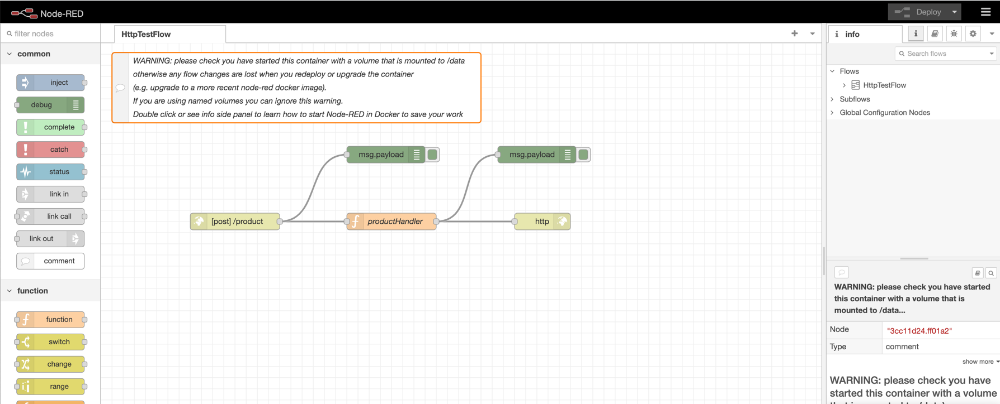

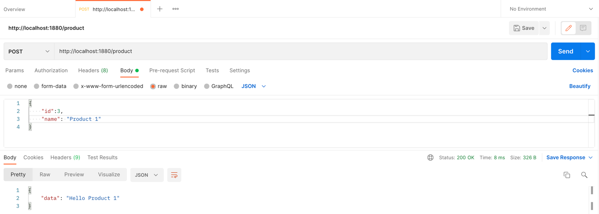
## MongoDB CRUD Operation
### [Mlab](https://mlab.com/) - Mongo As A Service
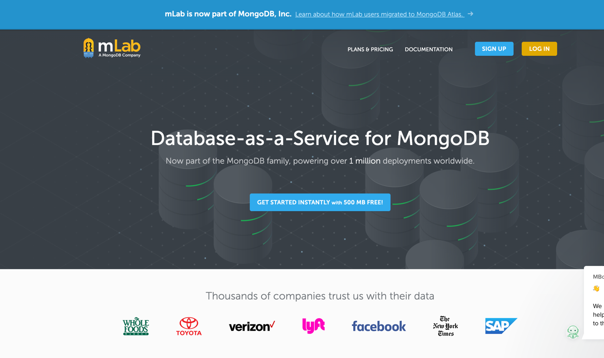
### Configure MongoDB in Node Red
#### Configure Mongo Instance in Node Red
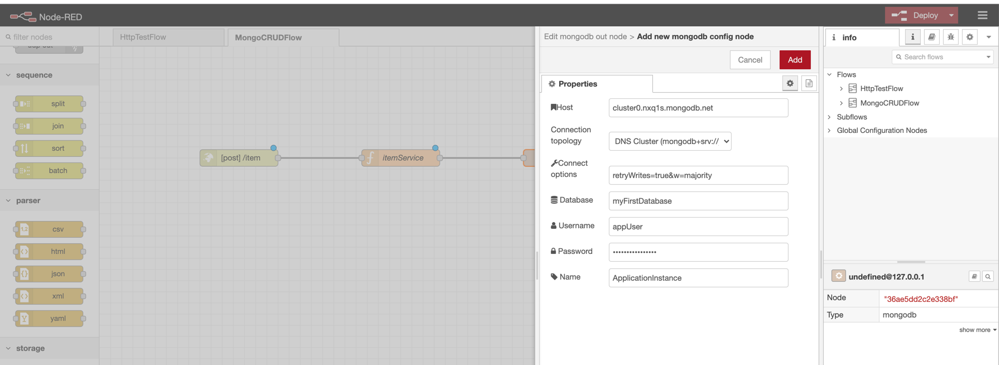 
#### Configure Collections & Operations
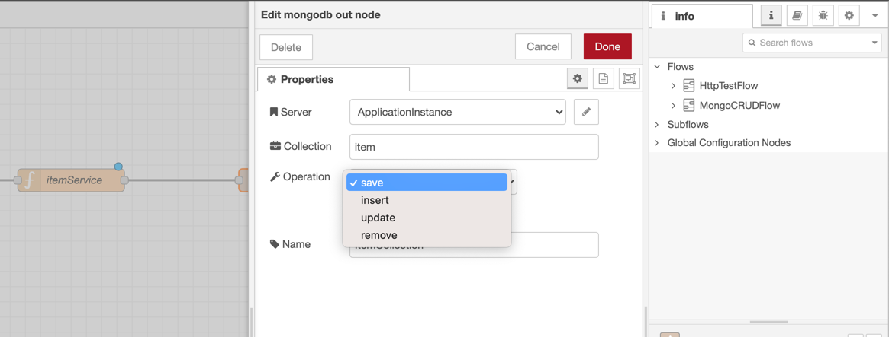
#### CRUD Operations
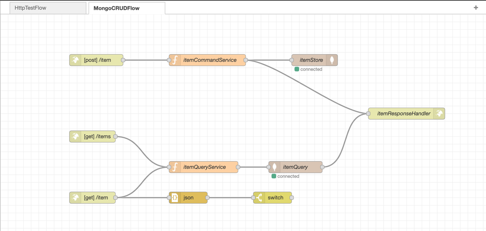
##### POST

##### GET By ItemName
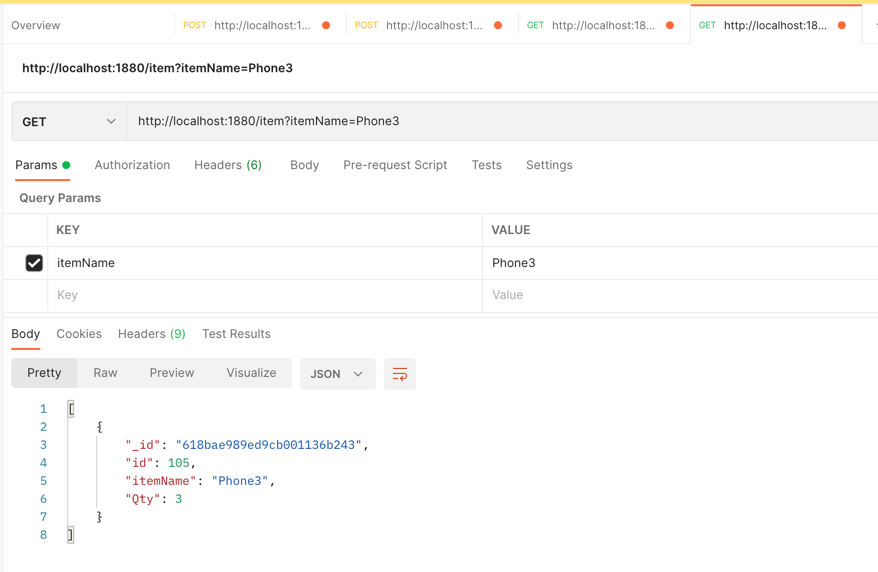
##### GET All
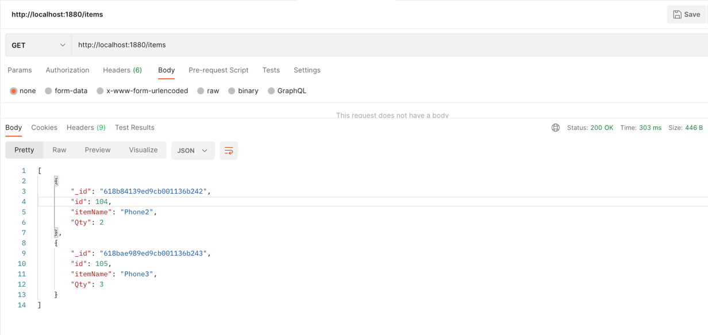

##  Kafka Integration
### [Cloudkarafka](https://www.cloudkarafka.com/) - Kafka As A Service
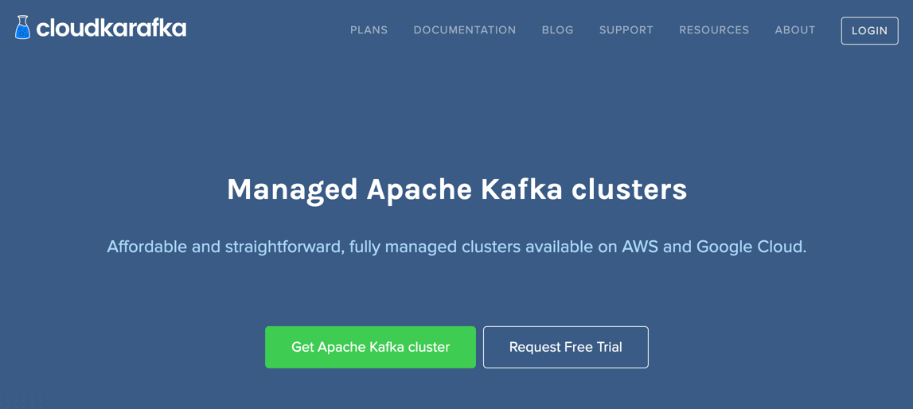
#### Configure Kafka Cluster in Node Red
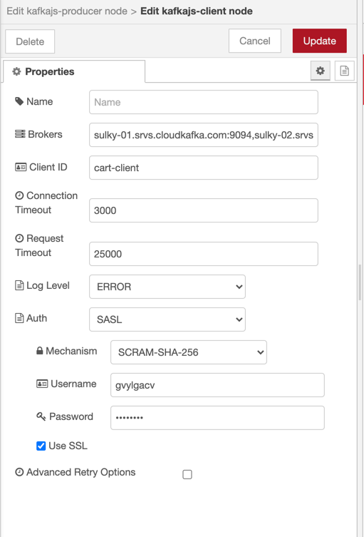
#### Configure Producer
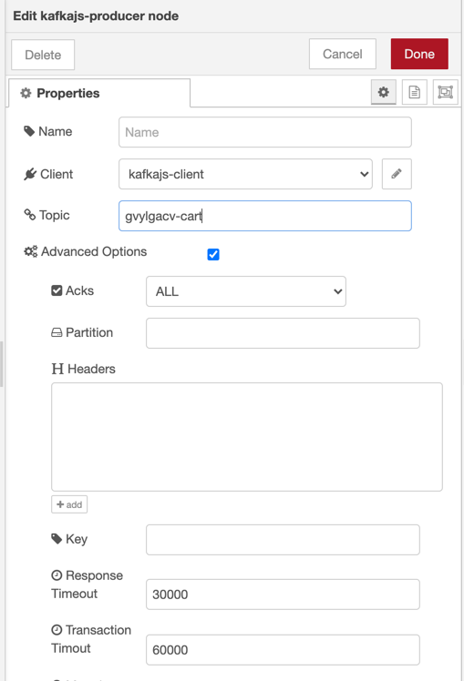
#### CQRS Pattern
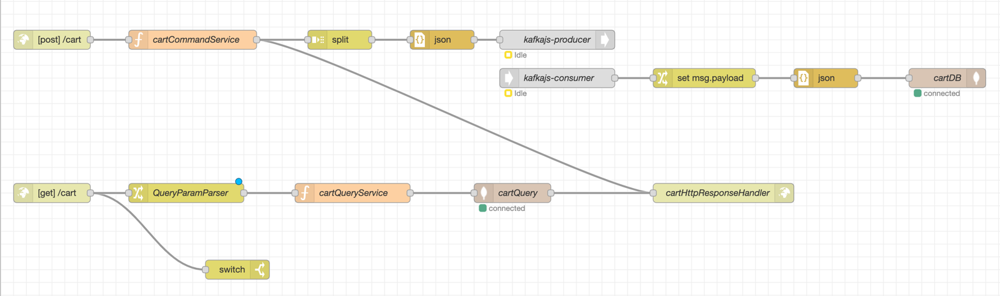
#### POST Request
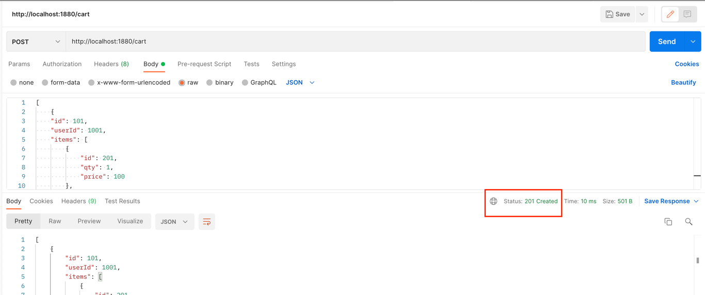
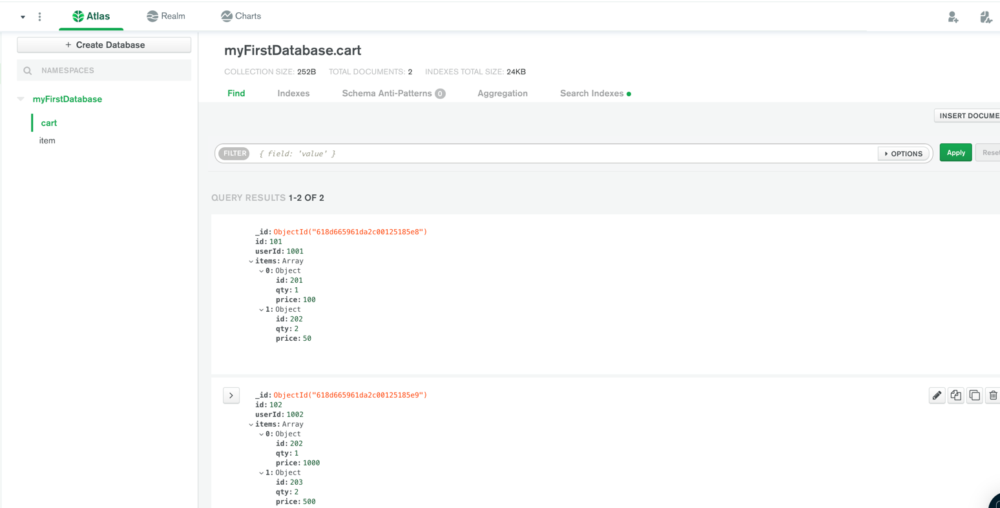
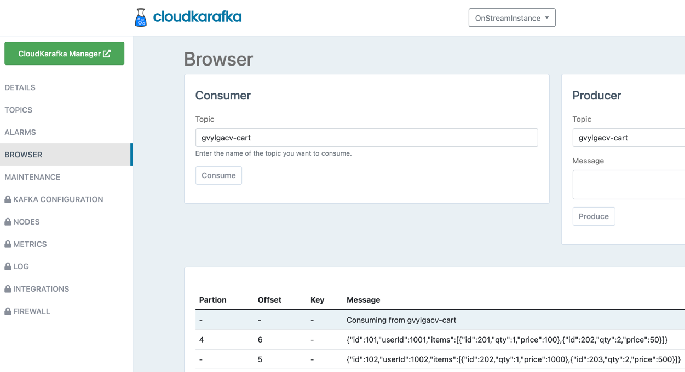
#### GET Request
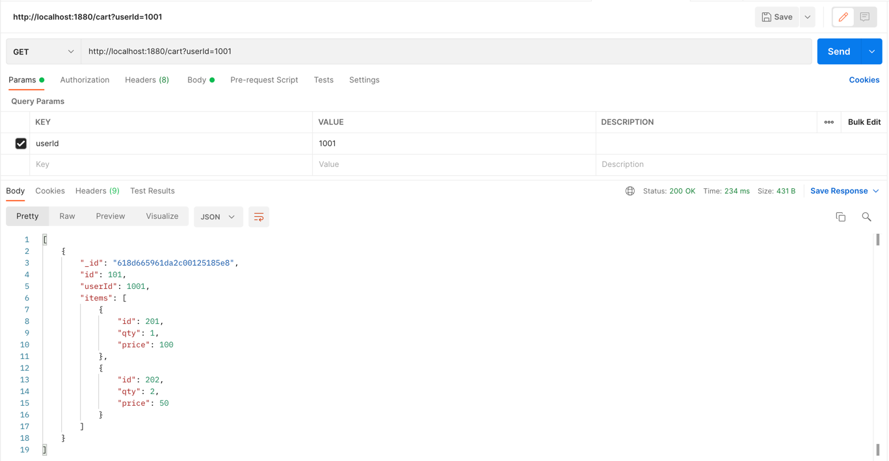

## Public API Calls
## Create Node Red Flow Docker Image
## Comparative study with opensource alternatives
## Placing Node Red in microservice architecture