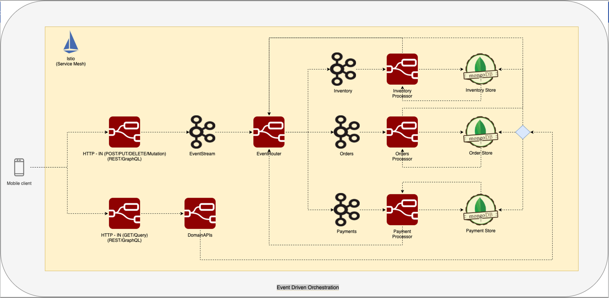

# Visual Programming - Create Microservice, Monolith or Distributed Monoliths faster than 2min Noodles 
- This blog throws light on low code Drag N Drop platforms that embrace the concept of Visual Programming and suggests how these platforms come handy when time to market is priority.
- Node-Red by IBM is one such opensource Drag N Drop platform that is taken as an example to present a fully-featured event driven platform.
- Node-Red not only simplify the creational and structural concerns for Software Architects but also helps in curbing staffing problems by promoting flow based visual programming.
## What is Visual Programming ?
```
A Visual Programming Language (VPL) is any programming language that lets users create programs by manipulating program elements graphically rather than by specifying them textually.
```
- https://en.wikipedia.org/wiki/Visual_programming_language

## Benefits of Node-Red
### Simplification
- As the name no-code/low-code indicates, coding is eliminated and programming is intuitively completed with a minimal number of operations needing to be used.
### Efficiency
- Node-RED flow editor takes care of building the application execution environment, library synchronization, the integrated development environment (IDE), and editor preparation so that you can concentrate on development.
### High quality
- High quality is the true value of flow-based and visual programming. <b>Each node provided as a component is a complete module that has been unit tested.</b>
### Open source
- Node-RED is an open source piece of software under the Apache2 license.
### Node-Red library
- Although Node-Red implement all aspects of CRUD operations but also provide placeholders for writing custom logic in NodeJs, for those who find it difficult to practically implement SOLID design principles.

## Node-Red alternatives
- Blockly by Google (https://developers.google.com/blockly)
- N8N (https://n8n.io/)
- Camunda (https://camunda.com/)
- Imixs Workflow (https://www.imixs.org/)

## Setup
- docker run -it -p 1880:1880 -v $PWD/data:/data nodered/node-red

## REST Implementation


## MongoDB CRUD Operation
### [Mlab](https://mlab.com/) - Mongo As A Service

### Configure MongoDB in Node Red
#### Configure Mongo Instance in Node Red
 
#### Configure Collections & Operations

#### CRUD Operations

##### POST

##### GET By ItemName

##### GET All


##  Kafka Integration
### [Cloudkarafka](https://www.cloudkarafka.com/) - Kafka As A Service

#### Configure Kafka Cluster in Node Red

#### Configure Producer

#### CQRS Pattern

#### POST Request


#### GET Request


## Placing Node Red in microservice architecture


## References
- https://en.wikipedia.org/wiki/Visual_programming_language
- https://subscription.packtpub.com/book/web_development/9781800201590/2/ch02lvl1sec05/node-red-benefits
- https://developer.ibm.com/blogs/top-5-reasons-to-use-node-red-right-now/